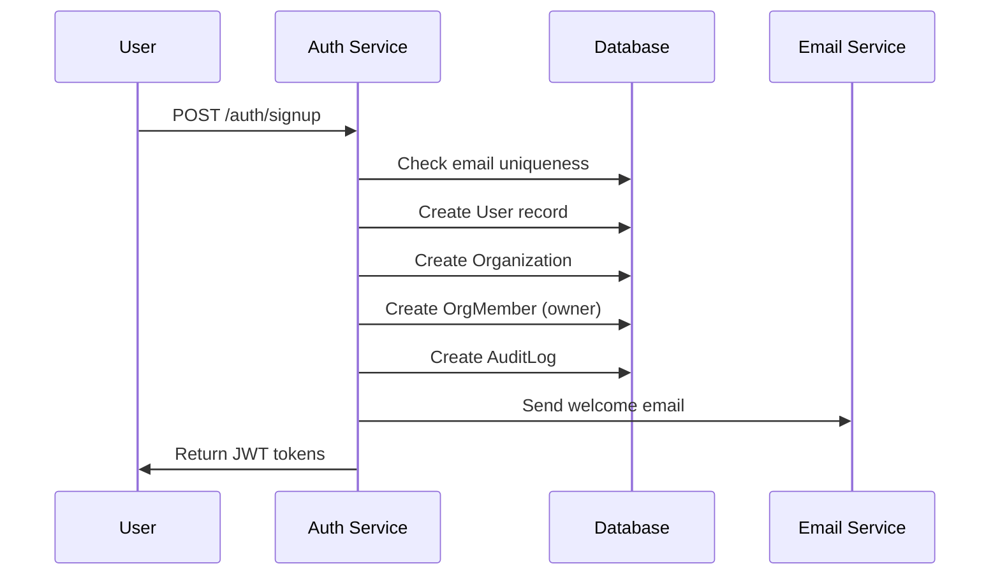
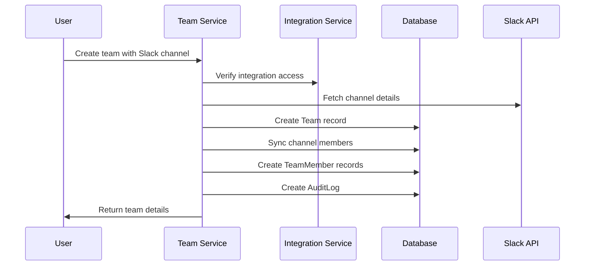
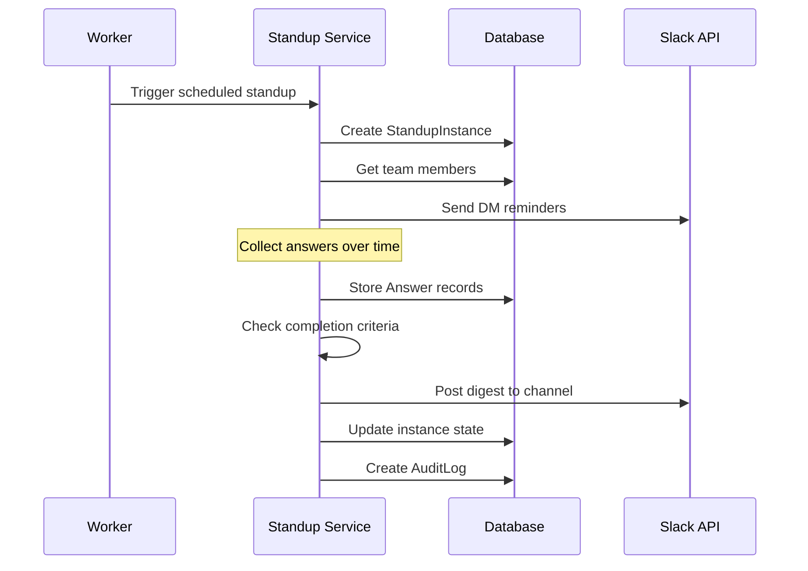
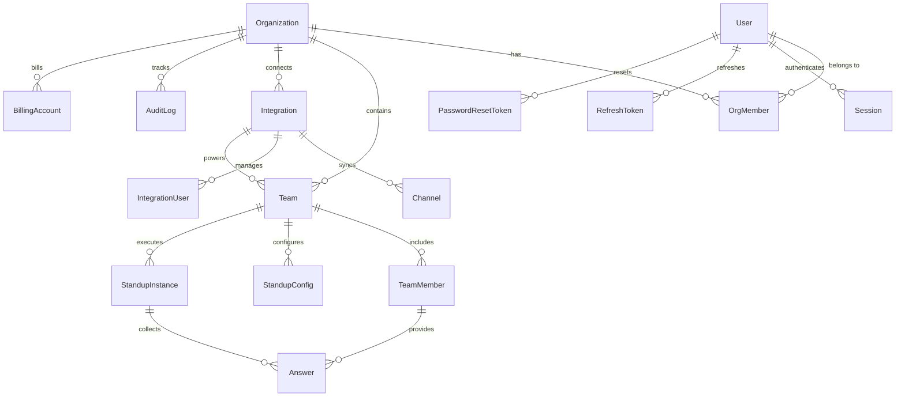

# Database Schema

This document describes the database schema for AsyncStand, built with Prisma and PostgreSQL.

## Overview

AsyncStand uses a multi-tenant database design where data is isolated by organization. The schema supports:

- **Multi-tenant user management** with organizations
- **Team-based standup management** linked to Slack channels
- **Comprehensive audit logging** for all actions
- **External platform integrations** (Slack, Teams)
- **Subscription billing** with usage tracking

## Core Entities

### User Authentication & Management

#### User

Central user entity supporting multi-organization membership.

```prisma
model User {
  id                         String       @id @default(uuid())
  email                      String       @unique
  passwordHash               String
  name                       String?
  twofaSecret                String?
  createdAt                  DateTime     @default(now())
  updatedAt                  DateTime     @updatedAt

  // Relations
  passwordResetTokens        PasswordResetToken[]
  sessions                   Session[]
  refreshTokens              RefreshToken[]
  orgMembers                 OrgMember[]
  auditLogs                  AuditLog[]       @relation("AuditLogActor")
  integrationsInstalled      Integration[]    @relation("IntegrationInstalledBy")
  teamMembers                TeamMember[]     @relation("TeamMemberUser")
  createdTeams               Team[]           @relation("TeamCreatedBy")
  addedTeamMembers           TeamMember[]     @relation("TeamMemberAddedBy")
}
```

**Key Features:**
- UUID primary key for security
- Unique email constraint
- Argon2 password hashing
- Optional 2FA support
- Comprehensive relationship tracking

#### PasswordResetToken

Secure password reset functionality with expiration.

```prisma
model PasswordResetToken {
  token     String   @id @default(uuid())
  user      User     @relation(fields: [userId], references: [id], onDelete: Cascade)
  userId    String
  expiresAt DateTime

  @@index([token])
}
```

#### Session

User session tracking for security and analytics.

```prisma
model Session {
  id          String   @id @default(uuid())
  user        User     @relation(fields: [userId], references: [id], onDelete: Cascade)
  userId      String
  issuedAt    DateTime @default(now())
  lastSeenIp  String?
  revokedAt   DateTime?
}
```

#### RefreshToken

JWT refresh token rotation for enhanced security.

```prisma
model RefreshToken {
  id          String   @id @default(uuid())
  token       String   @unique
  user        User     @relation(fields: [userId], references: [id], onDelete: Cascade)
  userId      String
  createdAt   DateTime @default(now())
  lastUsedAt  DateTime?
  revokedAt   DateTime?
  fingerprint String
  ipAddress   String

  @@index([userId, createdAt])
}
```

### Multi-Tenant Organization Structure

#### Organization

Top-level tenant isolation entity.

```prisma
model Organization {
  id               String           @id @default(uuid())
  name             String?

  // Relations
  billingAccount   BillingAccount?
  members          OrgMember[]
  integrations     Integration[]
  teams            Team[]
  auditLogs        AuditLog[]
}
```

#### OrgMember

User membership in organizations with role-based access control.

```prisma
enum OrgRole {
  owner
  admin
  member
}

enum OrgMemberStatus {
  invited
  active
  suspended
}

model OrgMember {
  org          Organization @relation(fields: [orgId], references: [id], onDelete: Cascade)
  orgId        String
  user         User         @relation(fields: [userId], references: [id], onDelete: Cascade)
  userId       String
  role         OrgRole
  status       OrgMemberStatus
  inviteToken  String?      @unique
  invitedAt    DateTime?
  acceptedAt   DateTime?

  @@id([orgId, userId])
  @@unique([orgId, userId])
  @@index([inviteToken])
}
```

**Role Hierarchy:**
- **Owner**: Full access, billing management, delete organization
- **Admin**: User management, team configuration, integrations
- **Member**: Basic access, view teams, participate in standups

### Team & Standup Management

#### Team

Core entity for organizing standup participants around Slack channels.

```prisma
model Team {
  id             String       @id @default(uuid())
  org            Organization @relation(fields: [orgId], references: [id], onDelete: Cascade)
  orgId          String
  integration    Integration  @relation(fields: [integrationId], references: [id], onDelete: Cascade)
  integrationId  String
  channel        Channel?     @relation(fields: [channelId], references: [id], onDelete: SetNull)
  channelId      String?
  slackChannelId String       // The actual Slack channel ID
  name           String
  timezone       String
  createdBy      User?        @relation("TeamCreatedBy", fields: [createdByUserId], references: [id], onDelete: SetNull)
  createdByUserId String?
  createdAt      DateTime     @default(now())
  updatedAt      DateTime     @updatedAt

  // Relations
  members        TeamMember[]
  configs        StandupConfig[]
  instances      StandupInstance[]

  @@index([integrationId, slackChannelId])
  @@index([orgId, createdAt])
  @@unique([integrationId, slackChannelId])
}
```

#### TeamMember

Individual team membership with platform user linking.

```prisma
model TeamMember {
  id                String           @id @default(uuid())
  team              Team             @relation(fields: [teamId], references: [id], onDelete: Cascade)
  teamId            String
  platformUserId    String?          // Legacy field
  integrationUser   IntegrationUser? @relation("IntegrationUserTeamMember", fields: [integrationUserId], references: [id], onDelete: SetNull)
  integrationUserId String?
  user              User?            @relation("TeamMemberUser", fields: [userId], references: [id], onDelete: SetNull)
  userId            String?
  name              String?
  active            Boolean          @default(true)
  addedBy           User?            @relation("TeamMemberAddedBy", fields: [addedByUserId], references: [id], onDelete: SetNull)
  addedByUserId     String?
  addedAt           DateTime         @default(now())

  // Relations
  configMemberships StandupConfigMember[]
  answers           Answer[]

  @@unique([teamId, platformUserId])
  @@unique([teamId, userId], map: "unique_team_user")
  @@index([teamId, addedAt])
}
```

#### StandupConfig

Configurable standup questions and scheduling.

```prisma
model StandupConfig {
  id                     String        @id @default(uuid())
  team                   Team          @relation(fields: [teamId], references: [id], onDelete: Cascade)
  teamId                 String
  questions              String[]
  weekdays               Int[]         // 0 = Sunday
  timeLocal              String
  reminderMinutesBefore  Int           @default(10)

  // Relations
  configMembers          StandupConfigMember[]
}
```

#### StandupInstance

Individual standup execution with state tracking.

```prisma
enum StandupInstanceState {
  pending
  collecting
  posted
}

model StandupInstance {
  id             String       @id @default(uuid())
  team           Team         @relation(fields: [teamId], references: [id], onDelete: Cascade)
  teamId         String
  configSnapshot Json         // frozen copy at creation
  targetDate     DateTime
  state          StandupInstanceState
  createdAt      DateTime     @default(now())

  // Relations
  digestPost     StandupDigestPost?
  answers        Answer[]
  participationSnapshots ParticipationSnapshot[]

  @@index([teamId, targetDate])
}
```

#### Answer

Individual responses to standup questions.

```prisma
model Answer {
  standupInstance   StandupInstance @relation(fields: [standupInstanceId], references: [id], onDelete: Cascade)
  standupInstanceId String
  teamMember        TeamMember      @relation(fields: [teamMemberId], references: [id], onDelete: Cascade)
  teamMemberId      String
  questionIndex     Int
  text              String
  submittedAt       DateTime        @default(now())

  @@id([standupInstanceId, teamMemberId, questionIndex])
  @@index([teamMemberId])
}
```

### External Platform Integration

#### Integration

OAuth-based connections to external platforms.

```prisma
enum IntegrationPlatform {
  slack
  teams
}

enum TokenStatus {
  ok
  expired
  revoked
}

model Integration {
  id                String        @id @default(uuid())
  org               Organization  @relation(fields: [orgId], references: [id], onDelete: Cascade)
  orgId             String
  platform          IntegrationPlatform
  externalTeamId    String
  accessToken       String        // Encrypted
  refreshToken      String?       // Encrypted
  expiresAt         DateTime?
  tokenStatus       TokenStatus
  scopes            String[]      // Bot scopes granted
  userScopes        String[]      @default([])
  installedBy       User?         @relation("IntegrationInstalledBy", fields: [installedByUserId], references: [id], onDelete: SetNull)
  installedByUserId String?
  
  // Slack-specific OAuth v2 fields
  botToken          String?       // Encrypted
  botUserId         String?
  appId             String?

  // Relations
  teams             Team[]
  channels          Channel[]
  integrationUsers  IntegrationUser[]
  syncState         IntegrationSyncState?
  digestPosts       StandupDigestPost[]
  tokenRefreshJobs  TokenRefreshJob[]

  @@unique([orgId, platform, externalTeamId])
  @@index([tokenStatus])
}
```

#### Channel

Synchronized channel information from external platforms.

```prisma
model Channel {
  id             String       @id @default(uuid())
  integration    Integration  @relation(fields: [integrationId], references: [id], onDelete: Cascade)
  integrationId  String
  channelId      String       // Platform channel ID
  name           String
  topic          String?
  purpose        String?
  isPrivate      Boolean      @default(false)
  isArchived     Boolean      @default(false)
  memberCount    Int?
  createdAt      DateTime     @default(now())
  updatedAt      DateTime     @updatedAt
  lastSyncAt     DateTime?

  // Relations
  teams          Team[]

  @@unique([integrationId, channelId])
  @@index([integrationId, isArchived])
  @@index([name])
}
```

#### IntegrationUser

Platform users synchronized from external systems.

```prisma
model IntegrationUser {
  id              String      @id @default(uuid())
  integration     Integration @relation(fields: [integrationId], references: [id], onDelete: Cascade)
  integrationId   String
  
  // Generic fields that work for all platforms
  externalUserId  String
  name            String?
  displayName     String?
  email           String?
  isBot           Boolean     @default(false)
  isDeleted       Boolean     @default(false)
  profileImage    String?
  timezone        String?
  
  // Platform-specific data stored as JSON
  platformData    Json?
  
  createdAt       DateTime    @default(now())
  updatedAt       DateTime    @updatedAt
  lastSyncAt      DateTime?

  // Relations
  teamMembers     TeamMember[] @relation("IntegrationUserTeamMember")

  @@unique([integrationId, externalUserId])
  @@index([integrationId, isDeleted])
  @@index([integrationId, externalUserId])
}
```

### Audit & Compliance

#### AuditLog

Comprehensive activity tracking for security and compliance.

```prisma
model AuditLog {
  id                    String       @id @default(uuid())
  org                   Organization @relation(fields: [orgId], references: [id], onDelete: Cascade)
  orgId                 String
  actorUser             User?        @relation("AuditLogActor", fields: [actorUserId], references: [id])
  actorUserId           String?
  actorPlatformUserId   String?
  actorType             String       @default("user") // user, system, api_key, service
  
  // Event classification
  action                String
  category              String       // auth, user_management, data_modification, system, integration, billing
  severity              String       // low, medium, high, critical
  
  // Request/Response data
  requestData           Json?        // Method, path, body, query, headers, userAgent, ipAddress
  responseData          Json?        // StatusCode, body, executionTime
  
  // Resource tracking
  resources             Json?        // Array of affected resources with before/after values
  
  // Enhanced metadata
  sessionId             String?
  correlationId         String?
  tags                  String[]     @default([])
  executionTime         Int?         // Milliseconds
  
  // Legacy payload field (for backward compatibility)
  payload               Json?
  
  createdAt             DateTime     @default(now())

  @@index([orgId, createdAt])
  @@index([orgId, category, createdAt])
  @@index([orgId, severity, createdAt])
  @@index([orgId, actorUserId, createdAt])
  @@index([correlationId])
  @@index([sessionId])
}
```

**Audit Categories:**
- **auth**: Login, logout, password changes
- **user_management**: User creation, role changes, invitations
- **data_modification**: Team changes, configuration updates
- **system**: Application events, errors
- **integration**: Platform connections, sync events
- **billing**: Subscription changes, usage events

### Billing & Subscriptions

#### BillingAccount

Organization billing information.

```prisma
model BillingAccount {
  id                   String          @id @default(uuid())
  org                  Organization    @relation(fields: [orgId], references: [id], onDelete: Cascade)
  orgId                String          @unique
  stripeCustomerId     String
  billingEmail         String?
  defaultPaymentMethod String?
  taxId                String?
  country              String?

  // Relations
  subscription         Subscription?
}
```

#### Subscription

Active subscription tracking with usage limits.

```prisma
enum SubscriptionStatus {
  trialing
  active
  past_due
  canceled
}

model Subscription {
  id                    String           @id @default(uuid())
  billingAccount        BillingAccount   @relation(fields: [billingAccountId], references: [id], onDelete: Cascade)
  billingAccountId      String           @unique
  stripeSubscriptionId  String
  plan                  String
  memberQuota           Int
  status                SubscriptionStatus
  renewsAt              DateTime

  // Relations
  events                SubscriptionEvent[]
  planHistory           PlanHistory[]

  @@index([status])
  @@index([renewsAt])
}
```

## Data Flow Patterns

### User Registration & Onboarding



### Team Creation & Member Management



### Standup Execution Flow



## Database Relationships

### Entity Relationship Diagram



## Data Security & Privacy

### Encryption Strategy

**Encrypted Fields:**
- `Integration.accessToken` - Platform OAuth tokens
- `Integration.refreshToken` - OAuth refresh tokens  
- `Integration.botToken` - Bot access tokens
- `User.passwordHash` - Argon2 hashed passwords

**Encryption Implementation:**
```typescript
// Token encryption using AES-256-GCM
const encryptedToken = encrypt(token, process.env.ENCRYPTION_KEY);
const decryptedToken = decrypt(encryptedToken, process.env.ENCRYPTION_KEY);
```

### Data Retention Policies

**Audit Logs:**
- Retained for 7 years for compliance
- Anonymized after user deletion
- Indexed by date for efficient queries

**User Data:**
- Soft deletion with anonymization
- Hard deletion after 30 days (GDPR compliance)
- Export capabilities for data portability

**Session Data:**
- Active sessions: 7 days maximum
- Refresh tokens: 30 days with rotation
- Password reset tokens: 1 hour expiration

## Performance Optimizations

### Indexing Strategy

**Primary Indexes:**
```sql
-- User lookups
CREATE INDEX idx_user_email ON "User"(email);
CREATE INDEX idx_user_created_at ON "User"(created_at);

-- Organization data isolation
CREATE INDEX idx_org_member_org_user ON "OrgMember"(org_id, user_id);
CREATE INDEX idx_team_org_created ON "Team"(org_id, created_at);
CREATE INDEX idx_audit_log_org_created ON "AuditLog"(org_id, created_at);

-- Integration queries
CREATE INDEX idx_integration_org_platform ON "Integration"(org_id, platform);
CREATE INDEX idx_integration_token_status ON "Integration"(token_status);

-- Standup performance
CREATE INDEX idx_standup_instance_team_date ON "StandupInstance"(team_id, target_date);
CREATE INDEX idx_answer_team_member ON "Answer"(team_member_id);
```

**Composite Indexes:**
```sql
-- Multi-column queries
CREATE INDEX idx_audit_log_org_category_date ON "AuditLog"(org_id, category, created_at);
CREATE INDEX idx_refresh_token_user_created ON "RefreshToken"(user_id, created_at);
```

### Query Optimization Patterns

**Efficient Organization Isolation:**
```typescript
// Good: Organization-scoped queries
const teams = await prisma.team.findMany({
  where: { orgId: currentOrgId },
  include: { members: true }
});

// Avoid: Cross-organization queries
const allTeams = await prisma.team.findMany({
  include: { members: true }
});
```

**Pagination with Cursor:**
```typescript
// Efficient pagination
const users = await prisma.user.findMany({
  where: { orgMembers: { some: { orgId } } },
  take: 20,
  skip: page * 20,
  orderBy: { createdAt: 'desc' }
});
```

## Migration Strategy

### Schema Evolution

**Safe Migration Practices:**
1. **Additive Changes**: New columns with defaults
2. **Backwards Compatible**: Maintain old columns during transition
3. **Data Migration**: Separate from schema changes
4. **Rollback Plan**: Always have a rollback strategy

**Example Migration:**
```sql
-- Add new column with default
ALTER TABLE "User" ADD COLUMN "timezone" VARCHAR(50) DEFAULT 'UTC';

-- Backfill data
UPDATE "User" SET "timezone" = 'America/New_York' 
WHERE "id" IN (SELECT DISTINCT "user_id" FROM "OrgMember" WHERE "org_id" = '...');

-- Remove default after backfill
ALTER TABLE "User" ALTER COLUMN "timezone" DROP DEFAULT;
```

### Environment Consistency

**Development → Staging → Production:**
1. Generate migration in development
2. Test on staging with production data copy
3. Apply during maintenance window
4. Monitor for performance impact

## Backup & Recovery

### Backup Strategy

**PostgreSQL Backups:**
- Daily full backups with point-in-time recovery
- Backup retention: 30 days daily, 12 months monthly
- Cross-region replication for disaster recovery

**Backup Verification:**
```bash
# Test backup restoration
pg_restore --dbname=asyncstand_test backup_file.dump
```

### Data Recovery Procedures

**User Data Recovery:**
1. Identify affected time range
2. Restore from nearest backup
3. Apply transaction logs for point-in-time recovery
4. Validate data integrity

**Audit Trail Integrity:**
- Immutable audit logs with checksums
- Tamper detection through hash chains
- Blockchain-like verification for critical events

---

This database schema provides a robust foundation for AsyncStand's multi-tenant SaaS architecture with comprehensive audit trails, security controls, and performance optimizations. 